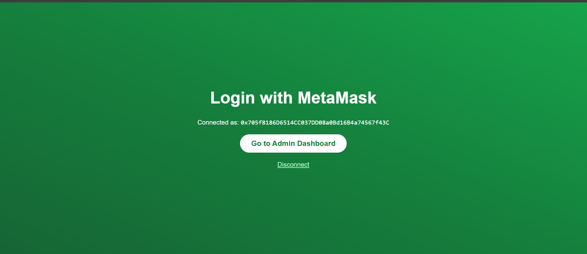
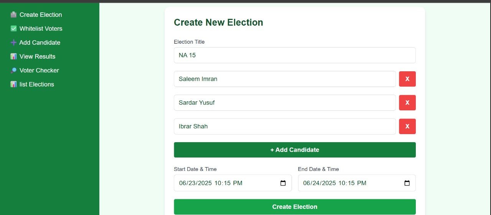
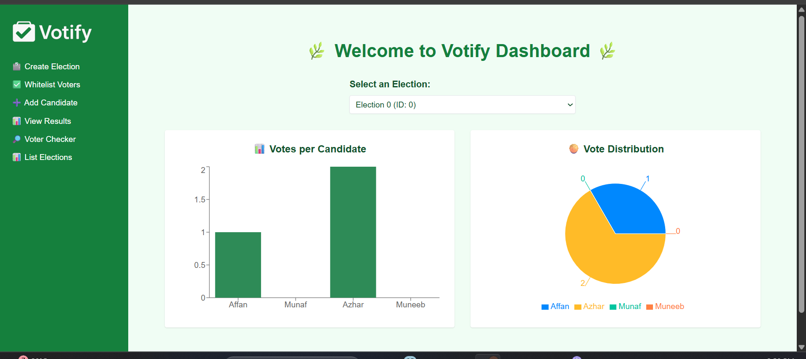

# 🗳️ Votify - Admin Dashboard

## 👨‍💻 Author

Built with 💚 by **Affan Javed**

[GitHub Profile](https://github.com/afanjaved)

This is the admin dashboard for **Votify**, a decentralized blockchain-based eVoting system. Built with [Next.js](https://nextjs.org), [Tailwind CSS](https://tailwindcss.com), and [wagmi + viem](https://wagmi.sh) for interacting with Ethereum smart contracts.

## 🚀 Features

- 🔐 MetaMask Login (Web3 Wallet Auth)
- 🗳️ Create and Manage Elections
- ✅ Whitelist Voters
- 📊 Live Voting Analytics (Bar, Pie, Line Charts)
- 🧠 Smart contract interaction via `wagmi` and `viem`
- 📱 Clean and responsive UI with TailwindCSS

## 📷 Screenshots

| Login with Wallet | Create Election | Analytics Dashboard |
|-------------------|------------------|----------------------|
|  |  |  |

---

## 🛠️ Tech Stack

- **Next.js** (App Router)
- **TypeScript**
- **Tailwind CSS**
- **Wagmi + Viem** (Web3 interactions)
- **MetaMask** for user wallet connection

---

## 📦 Getting Started

```bash
git clone https://github.com/YOUR_USERNAME/votify-dashboard.git
cd votify-dashboard
npm install
npm run dev
